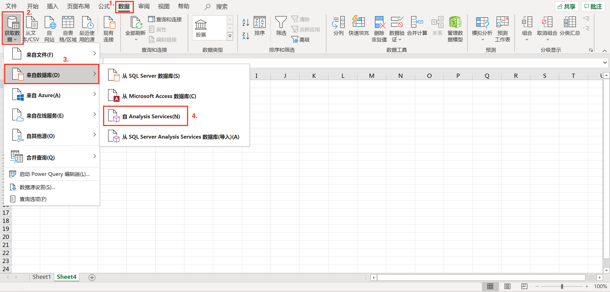
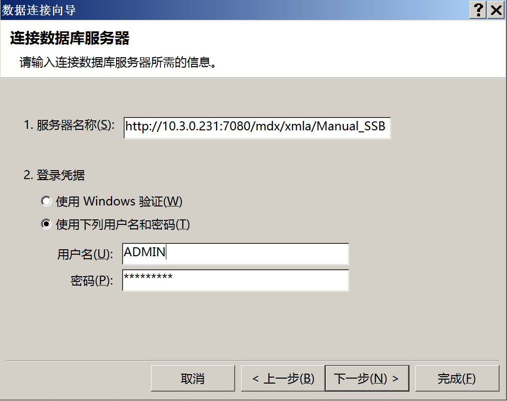
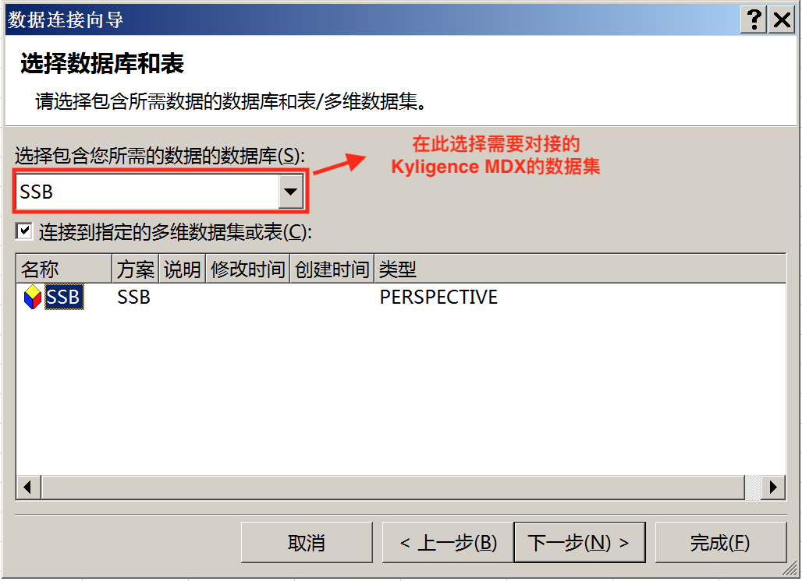
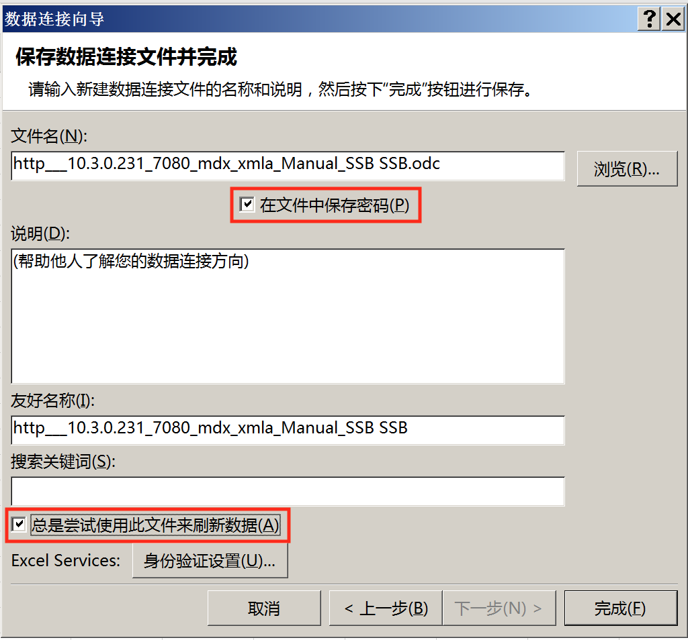
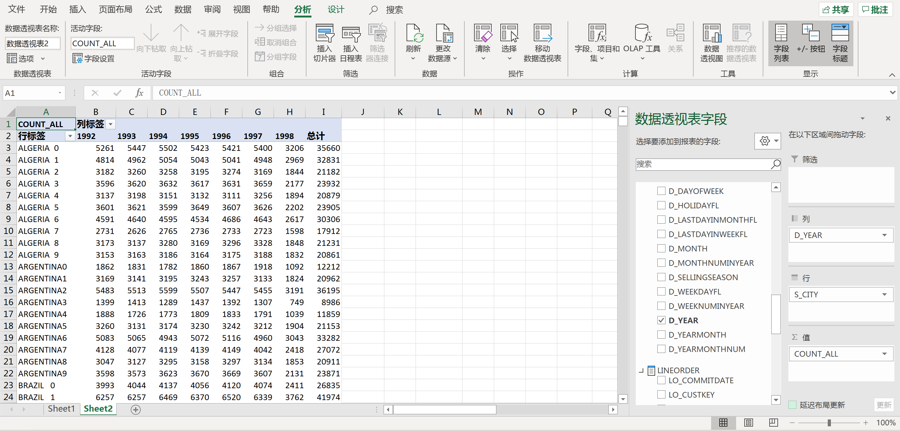

## 与 Excel 集成

本章节将介绍如何使用 Excel 分析 MDX for Kylin 中定义的数据集，使用 Excel 的数据透视表功能，通过 MDX for Kylin  直接在线查询分析 MDX for Kylin 中定义的数据集。

- [前提条件](#前提条件)
- [使用 Excel 连接 MDX for Kylin](#使用-excel-连接-mdx-for-kylin)
- [了解更多](#learn-more)

### 前提条件

1. 安装部署 **MDX for Kylin**

2. Window 中安装 **Excel 2007 及以上版本**

### 使用 Excel 连接 MDX for Kylin

1. 打开 Excel 中选择 **数据 —> 获取数据 —> 来自数据库 —>自 Analysis Services**

   

2. 接下来您需要在**服务器名称**一栏中填写连接 MDX for Kylin 的地址信息，样本如下：

   ```
   http://{host}:{port}/mdx/xmla/{project}
   ```

   MDX for Kylin 默认端口号是7080，project 为 MDX for Kylin 中访问的项目信息。管理员可以在 MDX for Kylin 的安装路径下的 `conf/insight.properties` 文件中 `insight.semantic.port` 配置项查找到 MDX for Kylin 的端口号。

   

   若设置了 `insight.semantic.context-path` 配置项，则需要将地址信息写成：

   ````
   http://{host}:{port}/{context-path}/mdx/xmla/{project}
   ````

   其中 host 和 port 都应该写成连接 Kylin 的信息。举例：

   ```shell
   # 设置 context-path 如下
   insight.semantic.context-path=/ws/testworkspace/mdx
   
   # kylin 登录地址，其中{host}:{port}为 10.10.10.200:7070
   http://10.10.10.200:7070/kylin
   
   # 则 Excel 中的地址信息应该写成
   http://10.10.10.200:7070/ws/testworkspace/mdx/mdx/xmla/test_project
   ```

   登录凭证请选择**使用下列用户名和密码**。用户名和密码为您的 MDX for Kylin 登录用户名和密码。

   

3. 现在数据集已经被连接到 Excel 了。选择您需要使用的数据集，点击下一步。

   

4. 勾选总是尝试文件来刷新数据，并勾选**在文件中保存密码**并勾选**总是尝试使用此文件来刷新数据**，点击完成。

   > 如果您没有勾选这两项，可能会出现频繁认证和刷新报表失败的情况。

   

5. 现在，您可以使用 Excel 透视表分析 MDX for Kylin 的数据集了。

   


### 了解更多{#learn-more}

欲了解更多 MDX for Kylin 对接 Excel 的支持情况，请参阅 [Excel 功能支持列表](excel_function_list.cn.md)。
