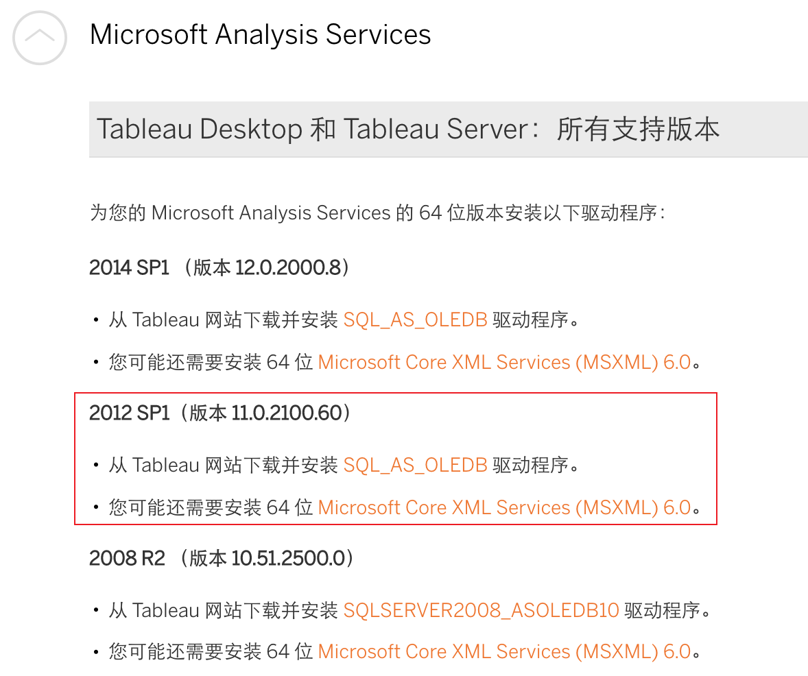
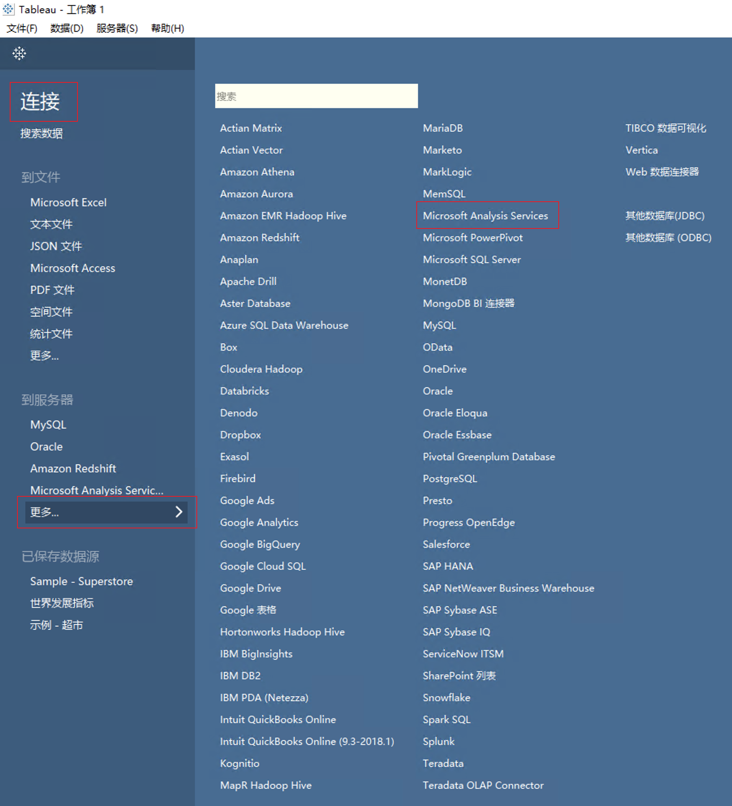
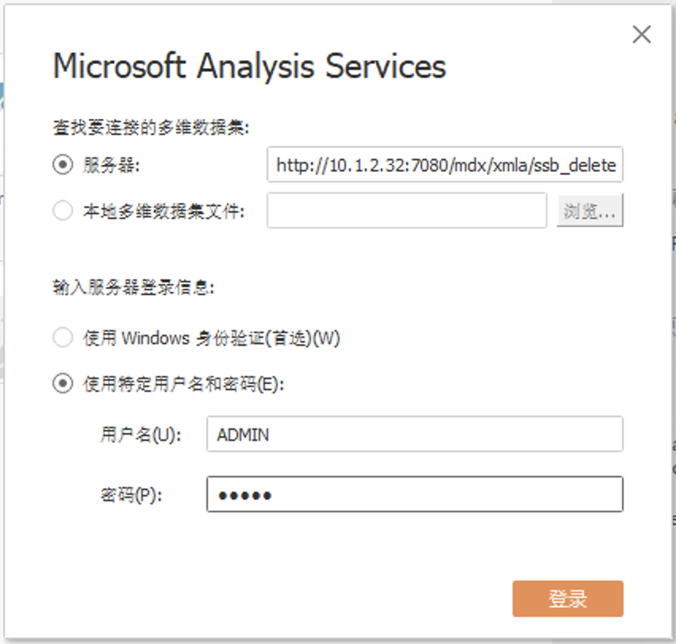
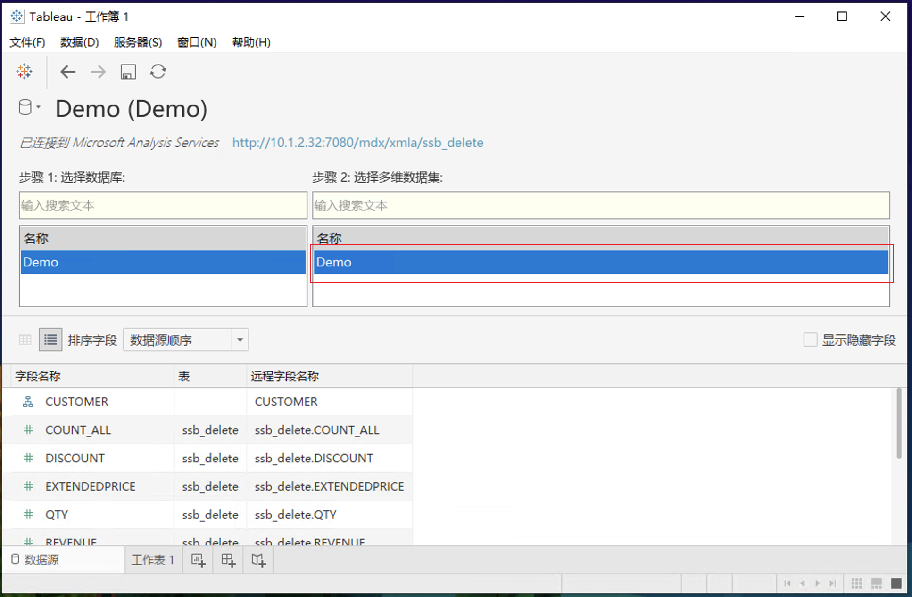
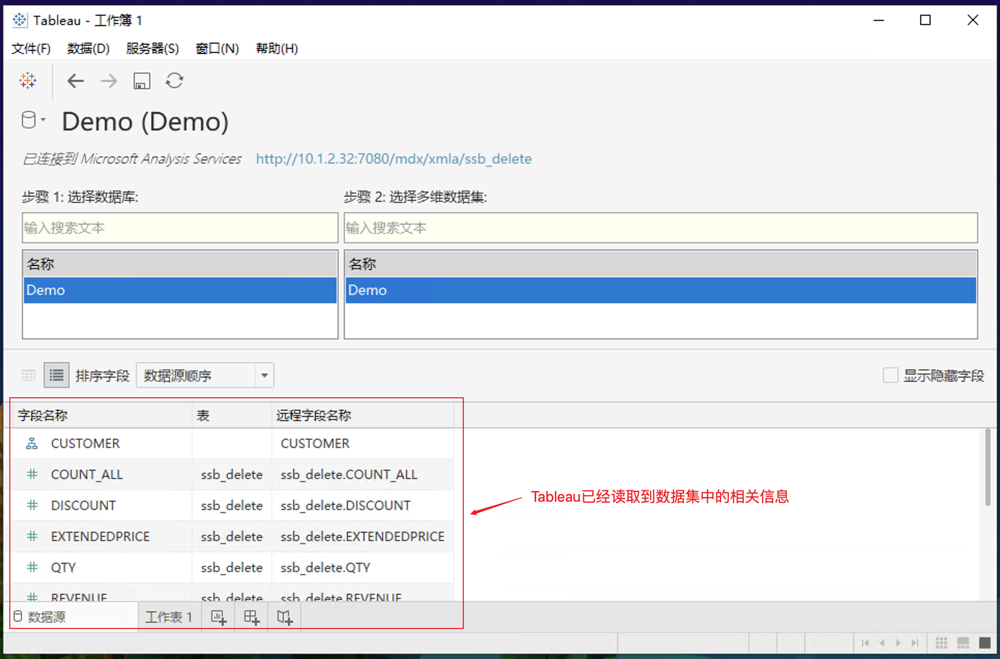
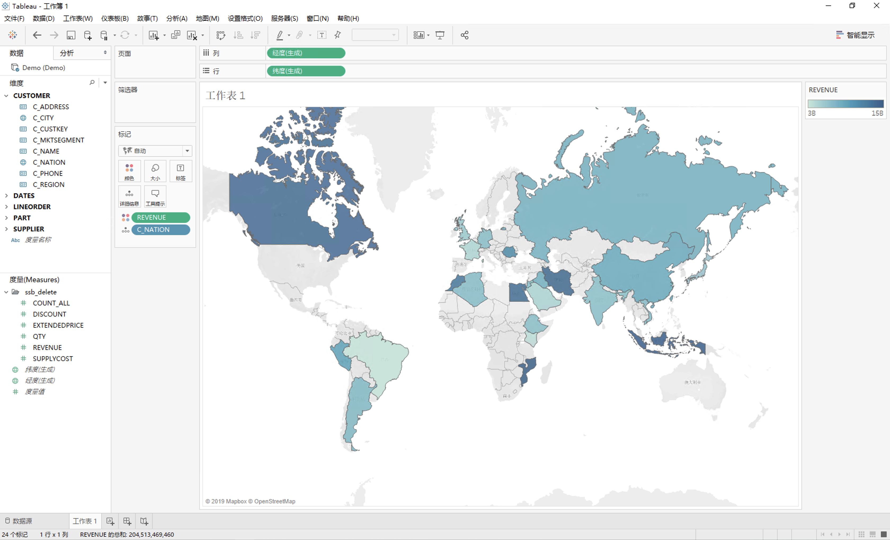

## 与 Tableau 集成

本章节将介绍如何使用 Tableau 分析 MDX for Kylin 中定义的数据集，使用 Tableau 的 Microsoft Analysis Services 连接器，直接在线查询分析 MDX for Kylin 中定义的数据集。

- [前提条件](#前提条件)
- [使用 Tableau 连接 MDX for Kylin](#使用-tableau-连接-mdx-for-kylin)

### 前提条件

1. 安装部署 **MDX for Kylin** 

2. 安装 Tableau 的 Microsoft Analysis Services 驱动，详见[Microsoft Analysis Services 驱动](https://www.tableau.com/zh-cn/support/drivers)

   推荐下载 **2012 SP1（版本 11.0.2100.60）**

   

### 使用 Tableau 连接 MDX for Kylin

1. 选择 **连接 —> Microsoft Analysis Services**

   

2. 接下来您需要在**服务器名称**一栏中填写连接 MDX for Kylin Semantic 的地址信息，样本如下：

   ```
   http://{host}:{port}/mdx/xmla/{project}
   ```

   MDX for Kylin Semantic 默认端口号是7080，用户名和密码时您的 MDX for Kylin 登录用户名和密码。

    

   若设置了 `insight.semantic.context-path` 配置项，则需要将地址信息写成：

   ````
   http://{host}:{port}/{context-path}/mdx/xmla/{project}
   ````

   其中 host 和 port 都应该写成连接 Kylin 的信息。举例：

   ```shell
   # 设置 context-path 如下
   insight.semantic.context-path=/ws/testworkspace/mdx
   
   # Kylin 登录地址，其中{host}:{port}为 10.10.10.200:7070
   http://10.10.10.200:7070/kylin
   
   # 则服务器地址信息应该写成
   http://10.10.10.200:7070/ws/testworkspace/mdx/mdx/xmla/test_project
   ```

   

3. 现在 Dataset 已经被连接到 Tableau 了。选择您需要使用的 Dataset，点击下一步。

   

4. 选择数据集后，Tableau即可读取数据集的相关信息，点击工作簿即可开始分析。

    

5. 现在，您可以使用 Tableau 分析 MDX for Kylin 的 Dataset 了。

   

