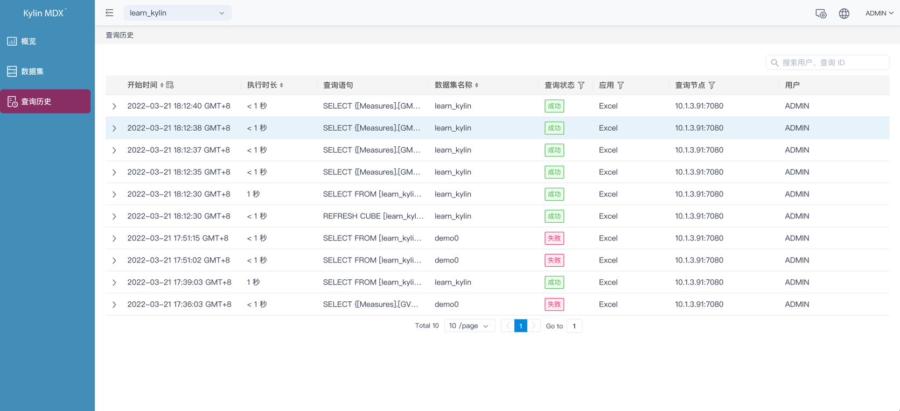
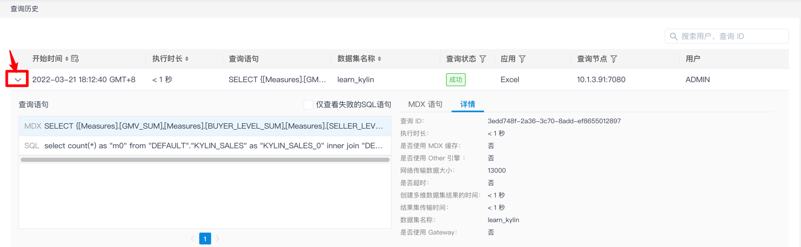
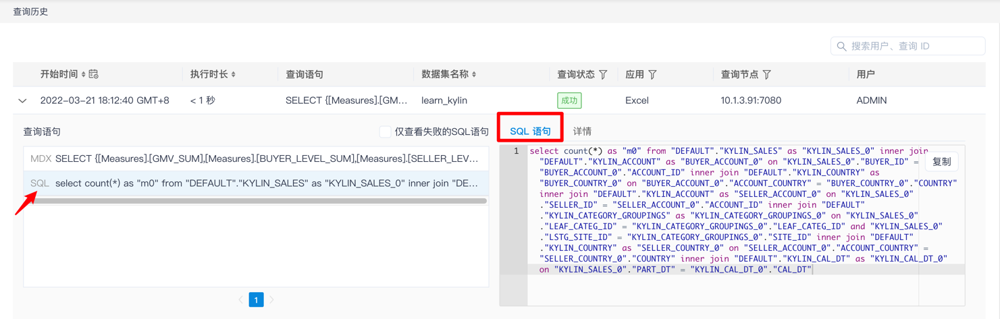
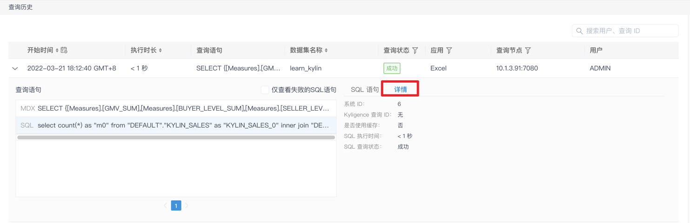

## 查询历史

此界面保存了查询的基本信息，如查询时间、MDX 语句、查询用户等，可以帮助您记录查询行为，以及更好地管理或优化模型。本节我们为您介绍查询历史界面的内容。

### 进入查询历史
点击左侧菜单栏中的**查询历史**，即可进入查询历史页面。如下图所示，只要您对 MDX 进行过查询，就能看到所有查询分析的基本信息。

图片中的每一行是一次查询记录，列的含义如下：

- **开始时间**：提交查询的时间

- **执行时长**：执行完成查询所用的时间

- **查询语句**：查询的 MDX 语句

- **数据集名称**：查询使用的数据集

- **查询状态**：有如下几种状态

  成功

  失败

- **应用**：提交查询的 BI 的类型

- **查询节点**：处理MDX请求的服务节点

- **查询用户**：提交查询的 MDX for Kylin 用户

### 查询历史详情
当您点击某一条查询分析左侧的箭头图标时，将展开当前 MDX 查询的详细信息，信息分为查询详情和 SQL 语句两个部分，其中查询详情展示 MDX 脚本和查询的基本信息（如：会话 ID、查询状态等），SQL 语句则展示相关的 SQL 脚本。

**【查询详情】**

相关详情含义：

- **查询 ID：** MDX 查询执行 ID
- **执行时长：** MDX 查询执行的时长
- **是否使用 MDX 缓存：** 查询是否击中 MDX 缓存
- **是否使用 Other 引擎：** 是否使用了 Other 引擎
- **网络传输数据大小：** 网络传输数据字节
- **是否超时：** 是否查询超时
- **创建多维数据集结束的时间：** 查询过程会生成的多维数据集的创建时间
- **结果集传输时间：** 查询结果传输时间
- **数据集名称：** 查询的数据集名称
- **是否使用 Gateway**：发起查询的客户端是否使用 MDX for Kylin Gateway。

**【SQL 语句】**

> **注意**：SQL 语句中仅能看到前 1000 行 SQL 语句，您可以点击 SQL 语句框内右上角的复制按钮复制完整的查询语句。

点击更多信息，可以查看详情：

相关详情含义：
- **系统 ID**：SQL 查询执行 ID
- **Kylin 查询 ID**：返回结果集的行数
- **是否使用缓存**：查询是否击中缓存
- **SQL 执行时间**：SQL 执行时长
- **SQL 查询状态**：SQL 查询结果状态
