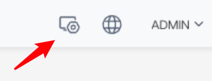
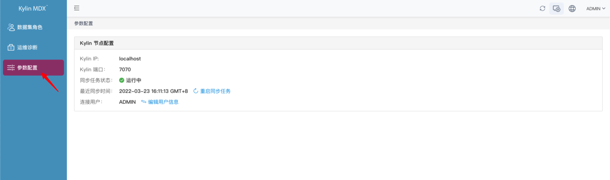
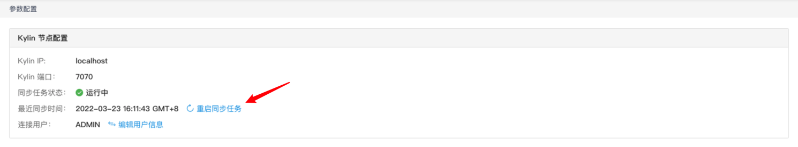
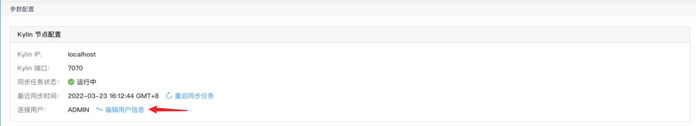

## 任务配置

现 MDX for Kylin 会定期从与其对接的 Kylin 中同步数据，您可以使用 Kylin 的系统管理员账号进入管理员页面，查看任务情况。

进入参数页面，即可同步任务的运行情况，以及任务上一次运行的时间。

若任务因为意外情况停止，例如 Kylin 停机等，您可以点击**重启同步任务**按钮重启同步任务

若您修改了您 Kylin 中的同于执行同步任务的系统管理员的用户名或密码，您可以点击**编辑用户信息**按钮，更改用户名和密码。

