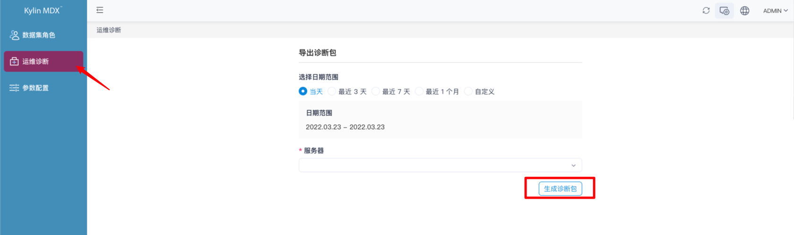
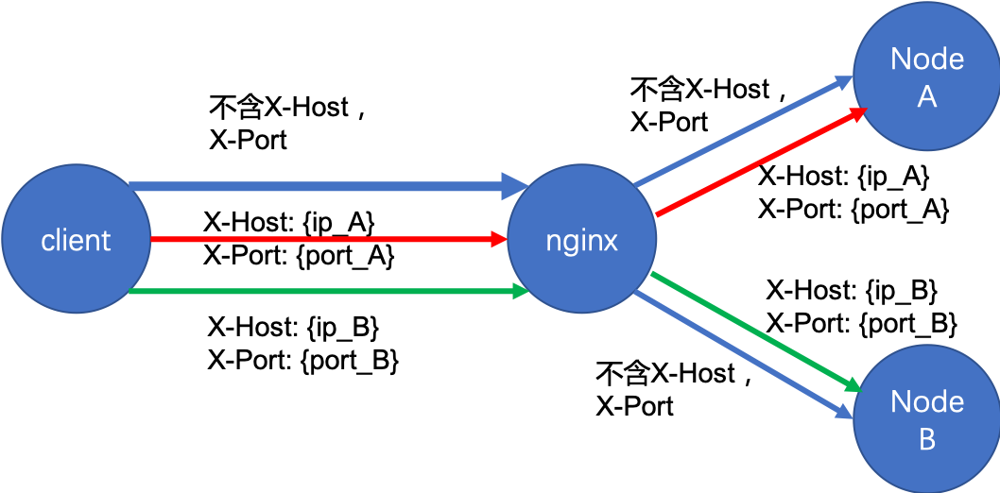

## 诊断包

- [系统配置](#系统配置)
- [通过网页生成诊断包](#通过网页生成诊断包)
- [通过脚本生成诊断包](#通过脚本生成诊断包)
- [多节点部署配置示例](#多节点部署配置示例)
	- [MDX for Kylin 配置项](#mdx-for-kylin-配置项)
	- [对 Nginx 路由规则配置要求](#对-nginx-路由规则配置要求)
- [诊断包内容](#诊断包内容)
- [注意信息](#注意信息)

### 系统配置

Kylin 需要您在安装时正确的配置每个节点的信息，详见手册[在 Linux 环境安装](../installation/install_linux.cn.md)

### 通过网页生成诊断包

系统诊断包包含整个 MDX for Kylin 实例的诊断信息，生成系统诊断包需要如下操作

+ 使用 Kylin 的系统管理员账户登录 MDX for Kylin

+ 点击右上角的**进入管理界面**按钮

	

+ 选择时间范围，您可以选择**当天**、**最近3天**、**最近7天**、**最近1个月**，或者自定义时间范围

  > **提示：** 选择的时间范围必须包含 MDX for Kylin 发生问题的时间段。

	 

+ 选择服务器

  > **提示：** 如果 MDX for Kylin 部署在多节点上，需要确定发生问题的节点，并在生成系统诊断包时选择正确的服务器名字，否则有可能系统诊断包中不包含问题的有关信息。

+ 之后您便可以下载诊断包。

### 通过脚本生成诊断包

除网页界面外，您也可以通过脚本生成诊断包

+ 您可以进入MDX如下目录 `$MDX_HOME/semantic-mdx/scripts/` 中,执行如下命令

`./diagnose_package_offline.sh <起始时间> <截止时间> <MDX ip> <MDX port> <是否dump mysql数据库> <诊断包输出路径>`

- `起始时间`: 13位时间戳;

- `截止时间`: 13位时间戳;

- `MDX ip`: MDX节点IP;

- `MDX port`: MDX节点端口;

- `是否dump mysql数据库`: 输入 y 表示需要 dump mysql，输入 n 表示不需要;

- `诊断包输出路径`: 诊断包输出路径，默认为 $MDX_HOME/semantic-mdx/diag_dump 目录下;

- 以下脚本执行示例表示打包 localhost 节点 7080 端口的 MDX 实例 ，时间范围为 `2021-03-07 - 2021-03-08`，需要 dump mysql 数据库, 且输出诊断包到目录 `/usr/local/`:

`./diagnose_package_offline.sh 1615046400000 1615132800000  localhost 7080 y /usr/local/`


### 多节点部署配置示例

#### MDX for Kylin 配置项

+ 您需要在每一个 MDX 节点的 `[MDX 安装目录]/conf/insight.properties` 文件中添加配置项  `insight.mdx.cluster.nodes=IP1:Port1,IP2:Port2`，将集群中所有 MDX for Kylin 节点的 IP 和 Port 信息加入配置文件中。

#### 对 Nginx 路由规则配置要求 

+ 根据自定义 `header`：`x-Host` 和 `x-Port` 以将请求转发到指定的节点上，以确保可以在页面上通知多个节点生成诊断包并下载。

+ 需要在 Nginx 配置文件中，添加路由规则：例如对两台机器上的 A、B 两个 MDX for Kylin 节点，其 IP 和 Port 分别为 `IP_A:Port_A` 和 `IP_B:Port_B`，则需要在 Nginx 的配置文件中添加如下配置：

  ```properties
  upstream nodes {
  	server ip_A:port_A;
  	server ip_B:port_B;
  }
  server {
  	listen port_N;
  	server_name ip_N;
  	#charset utf-8;(Recommended Use)
  	#Enable custom header
  	underscores_in_headers on;
  	location / {
  		if ($http_x_host = '') {
  				#Requests without custom headers can be sent to any node
  				proxy_pass http://nodes;
  				break;
  		}
  		#For requests containing custom headers, forward them to the specified node
  		proxy_pass http://$http_x_host:$http_x_port;
  		break;
  	}
  }
  ```

+ 此时的转发逻辑如下图所示：

	

### 诊断包内容

系统诊断包包含如下内容：

+ **conf_{timestamp}** 目录
  + **indicators.json** : MDX 计算度量模板文件，记录了定义计算度量可使用的模版信息
  + **insight.properties** : MDX 配置文件
  + **set-jvm.sh** : MDX JVM 参数配置文件（内容也可在 insight.properties 中相应参数中修改）
  + **startup.sh** : MDX 启动脚本
+ **logs_{timestamp}** 目录
  + **gc-{timestamp}.log** : MDX JVM GC 活动日志
  + **mdx.log** : MDX 查询日志，合并了若干 MDX 查询日志文件在指定时段内容（按原始文件修改时间排列，会标注 "Content above from file : " ）
  + **semantic.log** : MDX API 调用日志，合并了若干 MDX API 调用日志文件在指定时段内容（如：从 Kylin 同步信息、页面数据集访问等）
  + **jstack.log** : MDX 进程 ID、core file、远程调试服务的 Java 堆栈信息
  + **jmap.log** : MDX 进程内存的映射信息和堆空间分配情况
  + **top.log** : 系统中各个进程资源的占用状况
  + **mos_scripts.out** : 分布式 MDX 启动时记录拷贝服务器 Hadoop 相关配置文件以及替换相关冲突 jar 包的过程信息
+ **mdx_env** ：MDX 运行环境信息文件，包含从 MDX 版本、JDK 版本到系统环境等详细信息
+ **sync_info** ：MDX 同步任务信息文件，包含当前同步用户名和当前同步任务状态
+ **schema_{timestamp}** 目录
  + **{user}_{project}.xml** : 若干文件，数据集的结构信息（同一数据集对不同用户可能因可见性设置有不同的结构）
+ **dataset_{timestamp}** 目录
  + **Project-{project}_Dataset-{dataset}.json** : 若干文件，数据集的 json 文件，可用于从前端界面导入（需要连接相应的 Kylin)

### 注意信息

+ 多节点部署配置示例中 Nginx 配置为示例配置，具体的路由方式和过滤范围可根据实际需要进行调整。
+ 由于请求诊断包时使用配置文件中给出的 IP 和 Port 信息，请不要使用 localhost，可能会导致 Nginx 转发失败导致请求无法成功。
+ 每次新生成诊断包时，会**清除 7 天前生成的诊断包**。
