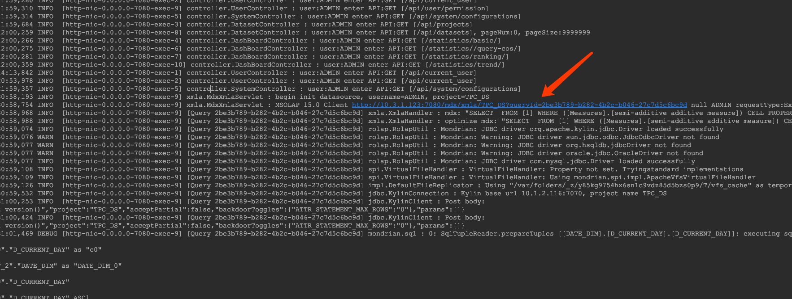

## 系统日志

MDX for Kylin 顺利启动后，默认会在安装目录下生成`logs/`目录，所有 MDX for Kylin 运行过程中生成的日志文件会保存在该目录中。

### 日志文件

MDX for Kylin 生成的日志文件如下：

#### `mdx.log`

该文件是通过 Excel 访问 Semantic 时生成的日志，默认级别 INFO。

#### `semantic.log`

该文件是 Semantic 服务生成的日志，默认级别 INFO。

#### `semantic.out`

该文件是标准输出的重定向文件，一些非 Semantic 生成的标准输出将被重定向到该文件。

#### `gateway.log`

该文件是 Gateway 服务生成的日志，默认级别 INFO。

### 日志配置

MDX for Kylin 使用 log4j 记录日志，用户可以编辑 `$MDX_HOME/conf/` 目录中的 `log4j.properties` 文件，
对日志文件的切分规则、大小上限等属性进行修改。例如：

- `semantic.log` 和 `mdx.log` 日志文件的默认输出类型是 `org.apache.log4j.RollingFileAppender`，
  即文件大小达到指定尺寸的时候产生一个新文件。如果您想要每天产生一个日志文件，可以将 `log4j.appender.file`
  和/或 `log4j.appender.mdx` 配置项的值改为 `org.apache.log4j.DailyRollingFileAppender`。

- `log4j.appender.file.MaxFileSize` 和 `log4j.appender.mdx.MaxFileSize` 分别定义上述单个 
  `semantic.log` 和 `mdx.log` 日志文件的最大大小，默认值为 268435456 ，即 256MB。

- `log4j.appender.file.MaxBackupIndex` 和 `log4j.appender.mdx.MaxBackupIndex` 分别定义 
  `semantic.log` 和 `mdx.log` 日志文件的最大保留数量，默认值为 10。

修改 `log4j.properties` 文件后，需要重启 MDX for Kylin 使配置生效。

### 日志排错

MDX 日志中包含查询 ID 及 API 的调用者信息，可以通过这些信息来增加排错能力。

1. 查询 ID。对接 MDX 的 BI 工具发的 MDX 查询，都会在 MDX 生成唯一的查询 ID，可以根据查询 ID 去溯源相关的信息。

2. API的调用者信息。可以通过 API 的调用者信息，来定位操作用户。

