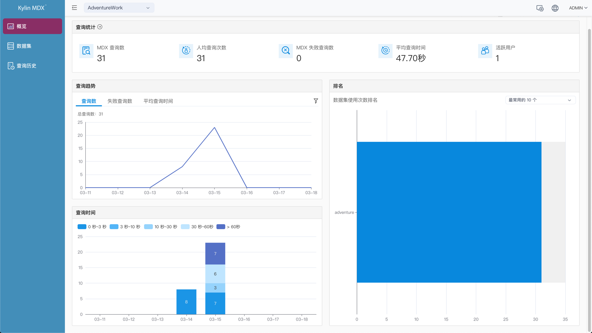
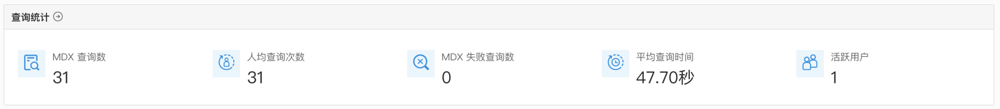
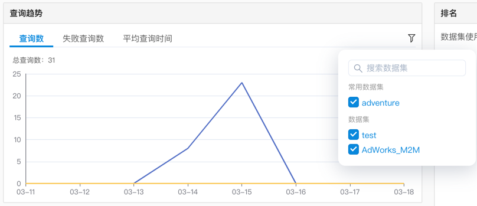
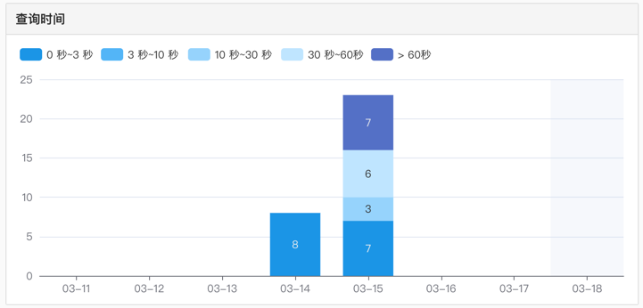
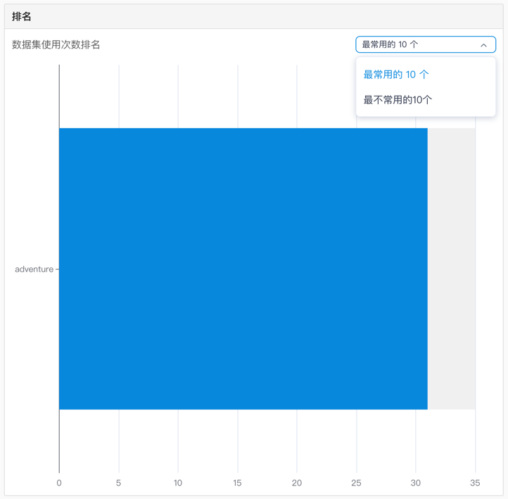

## 概览

在概览界面中，您可以监控 MDX for Kylin 系统的情况，了解每个项目的核心数据、指标和系统状态，包括该项目服务的用户数量、数据集使用量、查询次数等信息。

在概览界面右上角，您可以筛选时间区间，默认展示最近 7 天的数据。这里设置的时间范围将会作用到当前界面的所有指标。

### 查询统计

在查询统计区域，您可以查看当前项目的以下信息：

- MDX 查询数：历史 MDX 查询总数；
- 人均查询次数：用户人均查询次数；
- MDX 失败查询数：历史 MDX 的失败查询总数；
- 平均查询时间：所有查询的平均响应时间；
- 活跃用户：查询过的用户数。

您可以点击标题旁的按钮来跳转到查询历史界面。

### 查询趋势

在查询趋势区域，您可以查看当前项目的以下信息：

* 查询数：近期查询次数的变化趋势；
* 失败查询数：近期失败查询次数的变化趋势；
* 平均查询时间：近期平均查询响应时间的变化趋势。

图表中默认展示五个数据集的信息，您也可以通过点击右上角的筛选按钮，来指定其他的数据集。

### 查询时间

在查询时间区域，展示了此项目中不同时长的查询数量变化趋势。查询时长分为 0~3 秒，3~10 秒，10~30 秒，30~60 秒和大于 60 秒。

### 排名

在排名区域中按照查询次数由多到少，展示了最常用和最不常用的数据集，未被查询过的数据集不展示。

