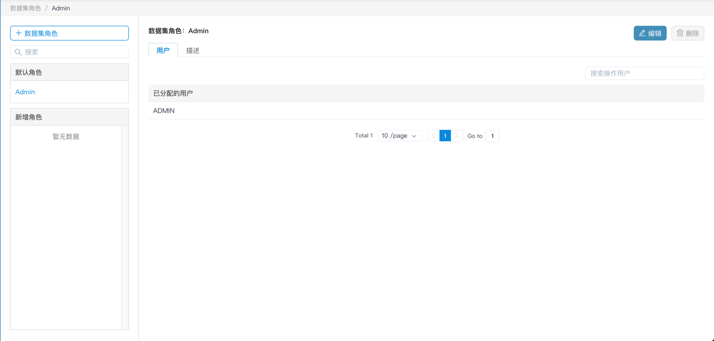
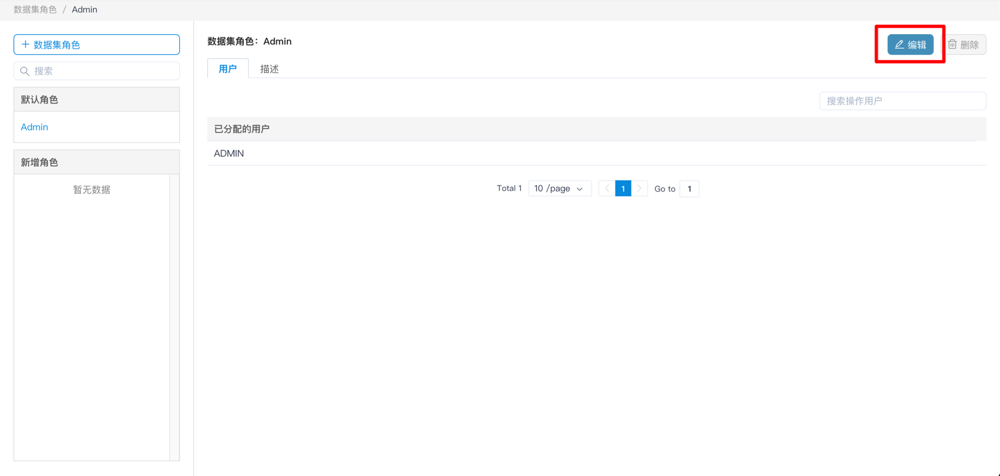
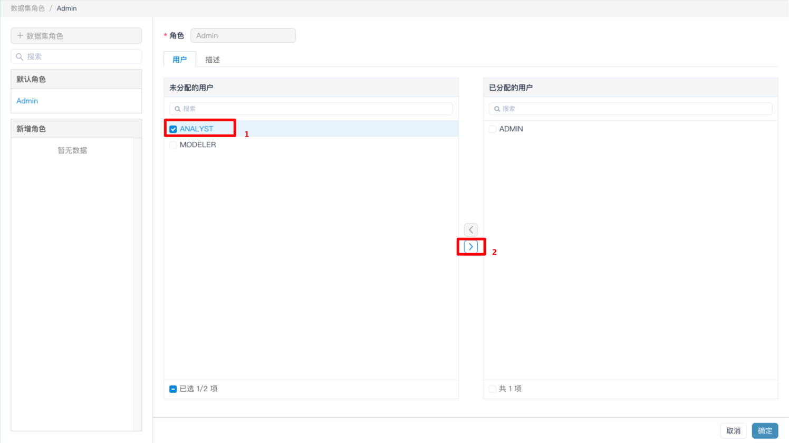
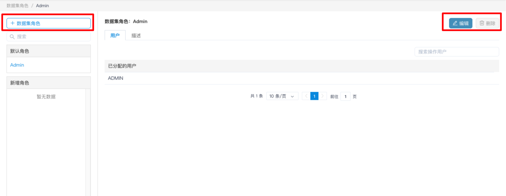

## 数据集角色

本节将介绍什么是角色，以及如何定义角色，及为用户分配角色。

- [数据集角色的定义](#数据集角色的定义)
- [默认 Admin 角色](#默认-admin-角色)
- [为用户分配角色](#为用户分配角色)
- [管理角色](#管理角色)
- [配置角色权限](#配置角色权限)

### 数据集角色的定义

MDX for Kylin 提供了用户级别的语义信息权限控制和角色级别的语义信息访问控制。如下信息需要注意：

1. 用户在未被分配任何数据集角色，或者配置用户级别的白名单时，用户无任何数据集的访问权限。
2. 用户必须至少具备一个数据集中一个度量或者一个计算度量的访问权限，否则用户无法连接该数据集。
3. 用户应该在 Kylin 中具备数据集对应的项目、表，否则无法连接数据集。
4. 用户被赋予多个角色时，最终的权限为各个角色级别和用户级别的白名单的合集，即若在数据集中用户 A 的访问权限为维度 1 和度量 1，角色 A 的访问权限为维度 2 和度量 2，同时用户 A 又属于角色 A，那么用户 A 的最终访问权限为维度 1、维度 2、度量 1 和度量 2。

### 默认 Admin 角色

- MDX for Kylin 初始会自带一个**默认角色**，即管理员（Admin）角色，其拥有**所有数据集的所有语义信息的访问权限**。

- Admin 角色的权限分配情况可在**进入管理页面**——>**数据集角色**页面 进行查看。

  

### 为用户分配角色

- 您可在**进入管理页面**——>**数据集角色**页面中将当前角色批量分配给用户。用户被分配角色后会获得当前角色所拥有的权限。

- 当用户被分配多个角色时，用户所拥有的权限是所有角色权限的合集。
	

	

### 管理角色

- 您可在**安全** - -> **角色** 中创建、编辑及删除角色。您可以批量修改被授予当前角色的用户列表。

  > 注意： 默认角色不可以被编辑和删除。

  

### 配置角色权限

想了解如何配置数据集角色的权限，您可以查看[配置权限列表](../dataset/access_list.cn.md)章节。
